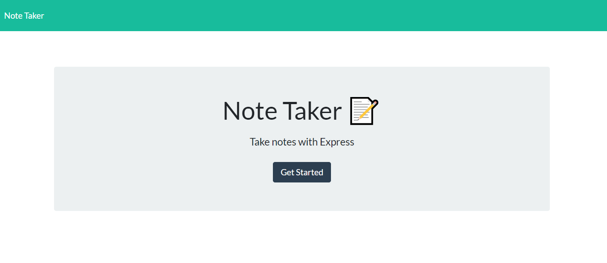
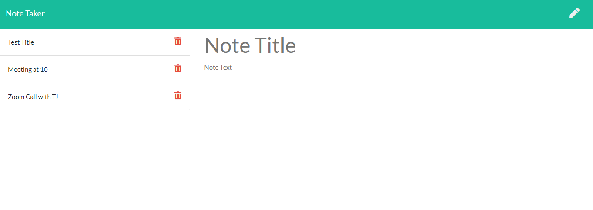

# Note Taker

## Goals of the project :

To build a Note Taker that can be used to write, save and delete notes. This application uses an Express.js back end and saves and retrieves note data from a JSON file.

The application is deployed to Heroku.

## Link of the website :

https://safe-spire-05163.herokuapp.com/

## Screenshot of the website

